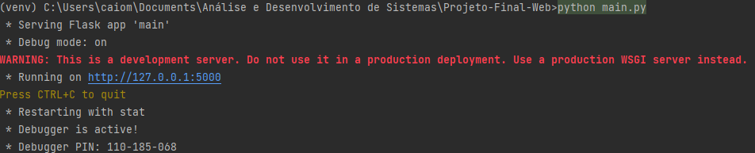

# Atividade Final (Desenvolvimento para Plataformas Web)
Projeto Desenvolvido por Caio Moretti de Macedo.

## Ferramentas Utilizadas
> Para esse projeto, utilizei algumas ferramentas para funcionalidades diferentes:
> - Frontend: BootsTrap (HTML e CSS)
> - Backend: Flask (Python)
> - Banco de Dados: MongoDB Atlas
> - Gestão do Banco de dados: MongoDB Compass
## Como configurar o MongoDB
Para Configurar o MongoDB você pode seguir os seguintes passos:
1. Acesse o [MongoDB Atlas](https://www.mongodb.com/cloud/atlas/register) e faça o login
2. Crie um Cluster
3. Em Database Access crie um usuário clicando em "ADD NEW USER" (nome e senha simples)
4. Em Network Access clique em "Add Ip Address"
5. Clique em Allow access from anywhere e automaticamente ele preencherá o campo do IP. Clique em Confirm.
6. Clique em connect.
7. Clique em Connect your Application.
8. Clique em Copy para copiar automaticamente.
9. Agora é só preencher os campos a seguir
>```python
>from flask import Flask, render_template, redirect, request, session
>from flask_pymongo import pymongo
>from pymongo import MongoClient
>from bson.objectid import ObjectId
>
>
>app = Flask(__name__)
>app.config['PERMANENT_SESSION_LIFETIME'] = 60 # session duration time (60s)
>
>CONNECTION_STRING = 'seu link copiado'
>client = pymongo.MongoClient(CONNECTION_STRING)
>db = client.get_database('seu database')
>usuarios_collection = db.sua-collection
>```

## Como Iniciar o Site
Para iniciar o site basta rodar o comando a seguir no seu terminal do diretório:
```shell
python main.py
```

## Como testar manualmente
Para testar manualmente basta acessar o link que aparece no seu terminal como ilustrado na imagem a seguir
